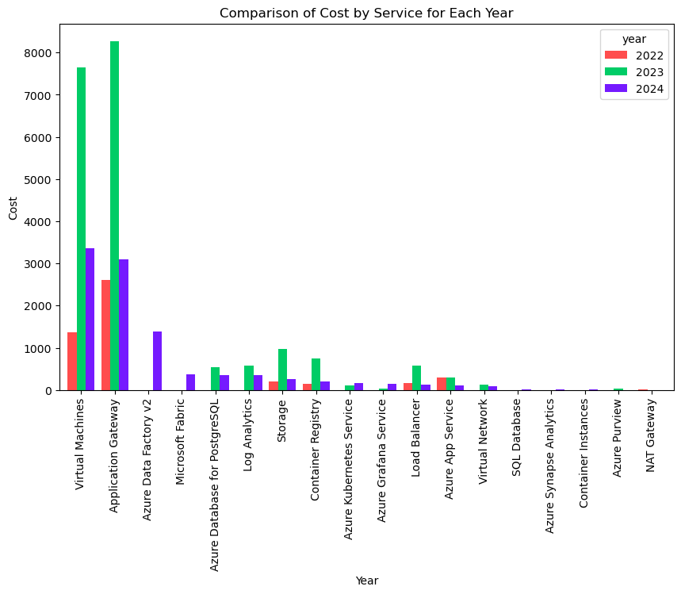
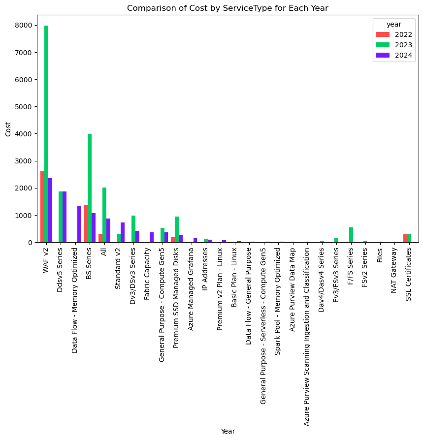
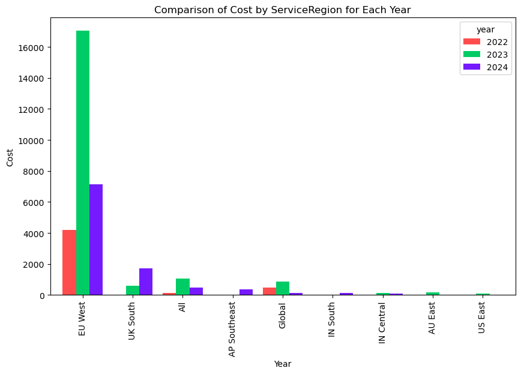
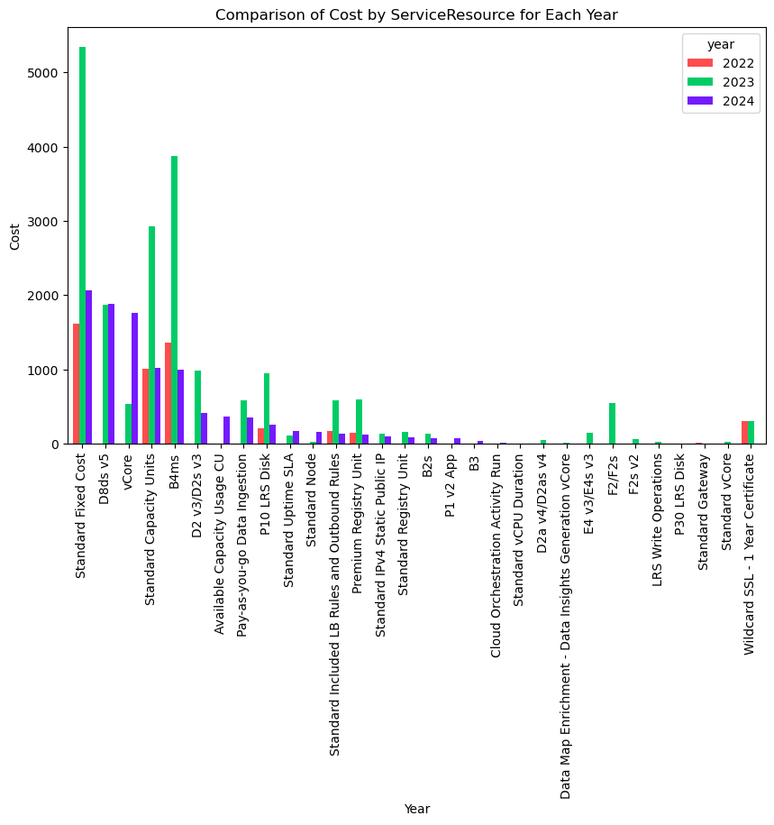
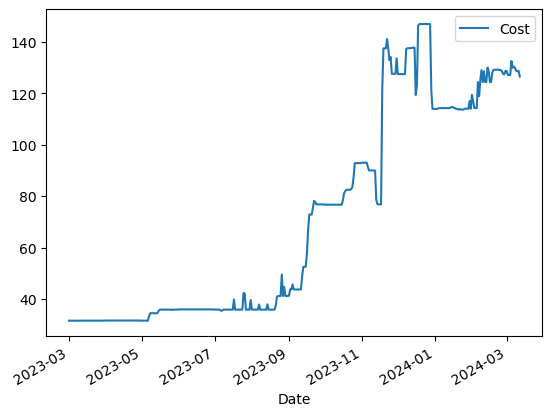

# Group F - Azure Cost Forecasting
  Azure cost Forecasting 

## Features
-Comparison of Cost by ServiceName for Each Year (2022-2024)
 
-Comparison of Cost by ServiceType for Each Year (2022-2024)
 
-Comparison of Cost by ServiceRegion for Each Year (2022-2024)
 
-Comparison of Cost by ServiceResource for Each Year (2022-2024)
 
-Conduct  the  correlation analysis
 
-Removing outliers

 -Train the model from 2022 year
   Root mean squared error:  52.76125287467291
  Root mean absolute error:  51.79842082945728
  
-Train the model starting from the year 2023 to account for the constant mean and variance between data points
 Root mean squared error:  19.4262794588951
 Root mean absolute error:  15.580326155110676

## Screenshot

 Analzing the cost from 2023-03-01 To 2023-03-12 

Group Members

-Chanuka Nimsara

-Dinusha Herath

-Buddhika Amarasinghe
